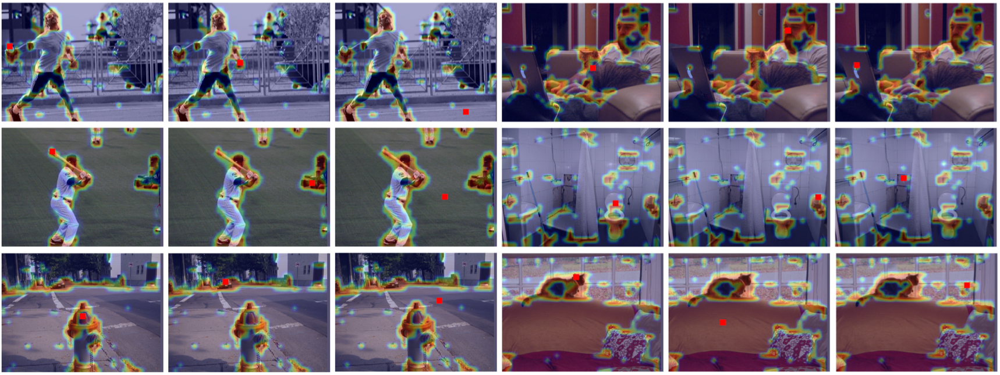

# GCNet: Non-local Networks Meet Squeeze-Excitation Networks and Beyond
By [Yue Cao](http://yue-cao.me), [Jiarui XU](http://jerryxu.net), Stephen Lin, Fangyun Wei, [Han Hu](https://sites.google.com/site/hanhushomepage/).

This repo is an implementation of [GCNet: Non-local Networks Meet Squeeze-Excitation Networks and Beyond](https://arxiv.org/abs/1904.11492) 
based on open-mmlab's [mmdetection](https://github.com/open-mmlab/mmdetection).
Many thanks to mmdetection for their simple and clean framework.

## Abstract

The Non-Local Network (NLNet) presents a pioneering approach for capturing long-range dependencies, via aggregating query-specific global context to each query position. 
However, through a rigorous empirical analysis, we have found that the global contexts modeled by non-local network are almost the same for different query positions within an image. 
In this paper, we take advantage of this finding to create a simplified network based on a query-independent formulation, which maintains the accuracy of NLNet but with significantly less computation. 
We further observe that this simplified design shares similar structure with Squeeze-Excitation Network (SENet). 
Hence we unify them into a three-step general framework for global context modeling. 
Within the general framework, we design a better instantiation, called the global context (GC) block, which is lightweight and can effectively model the global context. 
The lightweight property allows us to apply it for multiple layers in a backbone network to construct a global context network (GCNet), which generally outperforms both simplified NLNet and SENet on major benchmarks for various recognition tasks.

## Visualization

Visualization of attention maps (heatmaps) for different query positions (red points) in a non-local block on COCO object detection. 
In the same image, the attention maps of different query points are almost the same.

## Requirements
- Linux(tested on Ubuntu 16.04)
- Python 3.6+
- PyTorch 1.0.0
- Cython
- [apex](https://github.com/NVIDIA/apex) (Sync BN)

## Install
a. Install PyTorch 1.0 and torchvision following the [official instructions](https://pytorch.org/).

b. Install latest apex with CUDA and C++ extensions following this [instructions](https://github.com/NVIDIA/apex#quick-start). 
The [Sync BN](https://nvidia.github.io/apex/parallel.html#apex.parallel.SyncBatchNorm) implemented by apex is required.

c. Clone the GCNet repository. 
```bash
 git clone https://github.com/xvjiarui/GCNet.git 
 ```
d. Compile cuda extensions.
```bash
cd GCNet
pip install cython  # or "conda install cython" if you prefer conda
./compile.sh  # or "PYTHON=python3 ./compile.sh" if you use system python3 without virtual environments
```

e. Install GCNet version mmdetection (other dependencies will be installed automatically).

```bash
python(3) setup.py install  # add --user if you want to install it locally
# or "pip install ."
```

Note: You need to run the last step each time you pull updates from github. 
Or you can run `python(3) setup.py develop` or `pip install -e .` to install mmdetection if you want to make modifications to it frequently.


Please refer to mmdetection install [instruction](https://github.com/open-mmlab/mmdetection/blob/master/INSTALL.md) for more details.

## Environment

### Hardware

- 8 NVIDIA Tesla V100 GPUs
- Intel Xeon 4114 CPU @ 2.20GHz

### Software environment

- Python 3.6.7
- PyTorch 1.0.0
- CUDA 9.0
- CUDNN 7.0
- NCCL 2.3.5

## Usage
### Train
As in original mmdetection, distributed training is recommended for either single machine or multiple machines.
```bash
./tools/dist_train.sh <CONFIG_FILE> <GPU_NUM> [optional arguments]
```
Supported arguments are:
- --validate: perform evaluation every k (default=1) epochs during the training.
- --work_dir <WORK_DIR>: if specified, the path in config file will be replaced.

### Evaluation
To evaluate trained models, output file is required.
```bash
python tools/test.py <CONFIG_FILE> <MODEL_PATH> [optional arguments]
```
Supported arguments are:
- --gpus: number of GPU used for evaluation
- --out: output file name, usually ends wiht `.pkl`
- --eval: type of evaluation need, for mask-rcnn, `bbox segm` would evaluate both bounding box and mask AP. 

## Main Results

| Backbone  | Model            | Context        | Lr schd | box AP | mask AP | Download  |
|:---------:|:----------------:|:--------------:|:-------:|:------:|:-------:|:---------:|
| R-50-FPN  | Mask             | -              | 1x      | 37.2   | 33.8    | [model]() |
| R-50-FPN  | Mask             | GC(c3-c5, r16) | 1x      | 39.4   | 35.7    | [model]() |
| R-50-FPN  | Mask             | GC(c3-c5, r4)  | 1x      | 39.9   | 36.2    | [model]() |
| R-101-FPN | Mask             | -              | 1x      | 39.8   | 36.0    | [model]() |
| R-101-FPN | Mask             | GC(c3-c5, r16) | 1x      | 41.1   | 37.4    | [model]() |
| R-101-FPN | Mask             | GC(c3-c5, r4)  | 1x      | 41.7   | 37.6    | [model]() |
| X-101-FPN | Mask             | -              | 1x      | 41.2   | 37.3    | [model]() |
| X-101-FPN | Mask             | GC(c3-c5, r16) | 1x      | 42.4   | 38.0    | [model]() |
| X-101-FPN | Mask             | GC(c3-c5, r4)  | 1x      | 42.9   | 38.5    | [model]() |
| R-101-FPN | Cascade Mask     | -              | 1x      | 44.7   | 38.3    | [model]() |
| R-101-FPN | Cascade Mask     | GC(c3-c5, r16) | 1x      | 45.9   | 39.3    | [model]() |
| R-101-FPN | Cascade Mask     | GC(c3-c5, r4)  | 1x      | 46.5   | 39.7    | [model]() |
| R-101-FPN | DCN Cascade Mask | -              | 1x      | 47.1   | 40.4    | [model]() |
| R-101-FPN | DCN Cascade Mask | GC(c3-c5, r16) | 1x      | 47.9   | 40.9    | [model]() |
| R-101-FPN | DCN Cascade Mask | GC(c3-c5, r4)  | 1x      | 47.9   | 40.8    | [model]() |

**Notes:**
- `GC` denotes Global Context block is inserted after 1x1 conv of backbone. 
- `DCN` denotes replace 3x3 conv in `c3-c5` stages of backbone.
- `r4` and `r16` denote ratio 4 and ratio 16 GC block respectively. 

## Citation

